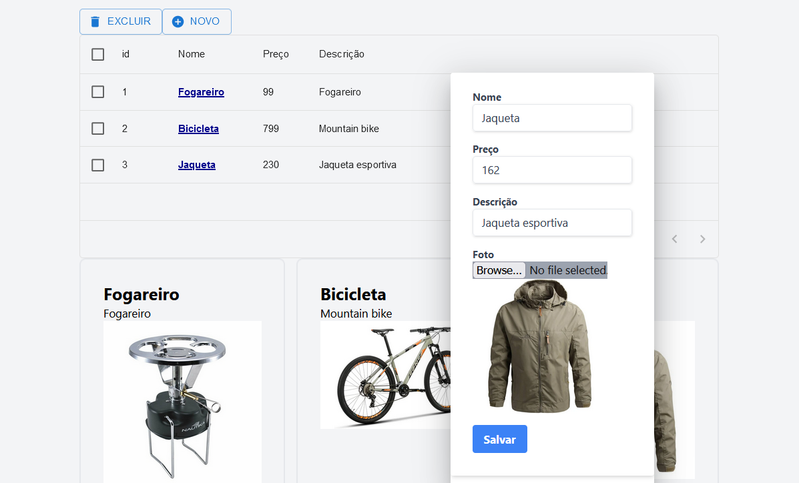

# Product Catalog using Next.js, Prisma and MySQL

## Screenshot

## Steps to run the project:
- NPM INSTALL
- Create .env file with DATABASE_URL
- Run PRISMA DB PUSH
- NPM RUN DEV to compile and start dev server
- Follow the link http://localhost:3000 to use the app
